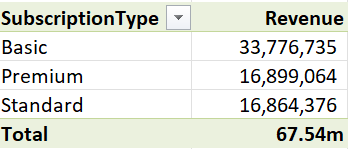

# Subscription Pattern Analysis

## Introduction

In this portfolio, I analyzed subscription data to derive insights on customer behavior and revenue generation. The analysis leverages Excel for data cleaning and pivot tables, SQL for querying data, and Power BI for visualization.

## Data Overview

### Dataset Description: 

- **Customer Name**: Name of the subscriber.
- **Subscription Types**: Various subscription plans (e.g., Basic, Premium).
- **Subscription Start and End Dates**: Dates marking the beginning and end of the subscription.
- **Region**: Geographic location of the customer.
- **Canceled Status**: Indicates whether the subscription is active or has been canceled.
- **Revenue**: The amount earned from each subscription.

 ## Tools Used

- Excel
- SQL
- Power BI

  ------

## Data Cleaning in Excel

**Importing Data**: The data was imported from my local file.

  **Data Cleaning Steps:** 
   
- **Removing Duplicates:** I Observed duplicates while going through the data sets and I used the remove duplicates feature to clean duplicates.
- **Date Formatting:** Ensure that the start and end dates are in a consistent format for analysis.

## Data Analysis with Excel Pivot Tables

**A. Total Revenue by Subscription Type**:
A key insight was that the Basic subscription type ranked highest in  total revenue generation compared to other subscription tiers, such as Premium and standard.

 

 **B. Count of Active vs. Canceled Subscriptions:**
This analysis of the count of active versus canceled subscriptions provides actionable      insights into customer behavior. Leaving the percentage of Active (False) subscription to be 55.09% and Canceled (True) subscription be 44.91%.

![](

      

