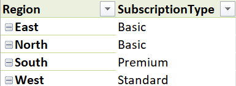

# Subscription Pattern Analysis

## Introduction

In this portfolio, I analyzed subscription data to derive insights on customer behavior and revenue generation. The analysis leverages Excel for data cleaning and pivot tables, SQL for querying data, and Power BI for visualization.

## Data Overview

### Dataset Description: 

- **Customer Name**: Name of the subscriber.
- **Subscription Types**: Various subscription plans (e.g., Basic, Premium).
- **Subscription Start and End Dates**: Dates marking the beginning and end of the subscription.
- **Region**: Geographic location of the customer.
- **Canceled Status**: Indicates whether the subscription is active or has been canceled.
- **Revenue**: The amount earned from each subscription.

 ## Tools Used

- Excel
- SQL
- Power BI

  ------

## Data Cleaning in Excel

**Importing Data**: The data was imported from my local file.

  **Data Cleaning Steps:** 
   
- **Removing Duplicates:** I Observed duplicates while going through the data sets and I used the remove duplicates feature to clean duplicates.
- **Date Formatting:** Ensure that the start and end dates are in a consistent format for analysis.

## Data Analysis with Excel Pivot Tables

**A. Total Revenue by Subscription Type**:
A key insight was that the Basic subscription type ranked highest in  total revenue generation compared to other subscription tiers, such as Premium and standard.

 

 **B. Count of Active vs. Canceled Subscriptions:**
This analysis of the count of active versus canceled subscriptions provides actionable insights into customer behavior. 

**C. Revenue by Region:**
The analysis reveals that the East Region is the highest revenue generating region with a total revenue of 16,958,763m. This indicates potential areas for further investment and targeted marketing to capitalize on this trend.

**D. Region by Subscription Type:**
The analysis shows that both the East and North regions have a notable presence of Basic subscriptions, indicating that these areas may be more price sensitive or prefer budget friendly options. This presents an opportunity for targeted marketing campaigns aimed at upselling Premium subscriptions in these regions.

## Using Excel Formulas

- **Average subscription duration:** Using the Average function, I was able to retrieve the average subscription duration to be 365 days.

                                          =AVERAGE(I2:I33788)

-  **The most popular subscription type:** I retrieved the most popular subscription type using the **COUNTIF** function and the subscription Type column. **Basic** is the most popular subscription type with 16,921 subscriptions.

                                           =COUNTIF(D2:D33788, L7)

   ---------

## SQL Queries
This is a quick overview of some SQL commands used to retrieve the subscription trends.

      

